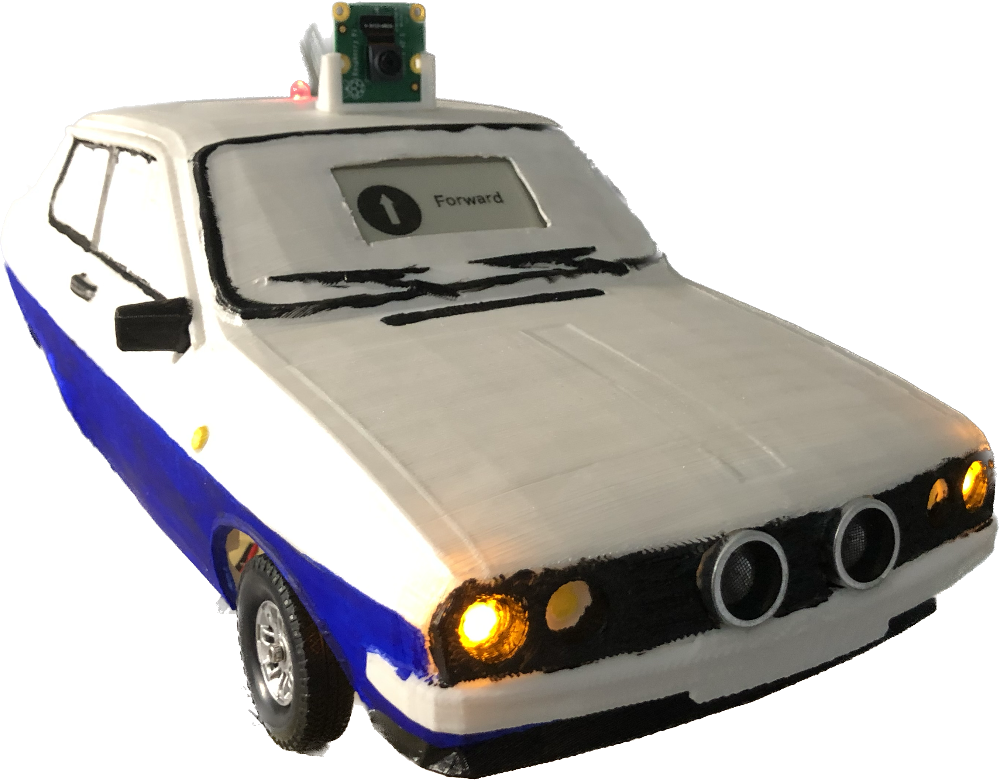

### Description: 
University Project back in 2019, with a smart car that could read instructions written on a paper and based on those turn lights on/off, go right, left, forward, backwards and display the information on an eink screen. It would also stop and turn around if it met an obstacle, eq proximity sensor 

### Hardware:
Car is 3d printed and modified

 
